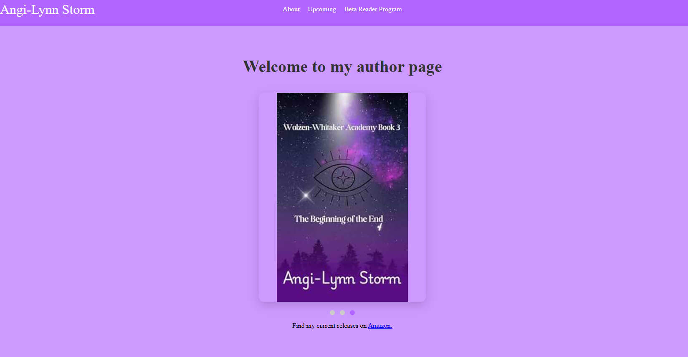

# Angi-LynnStorm

This site was developed for Angi-Lynn Storm, an independent author. She requested a mobile-friendly author webiste to display her current releases, upcoming releases, an about page and the ability for users to sign up to be beta readers for her upcoming releases.

## Deployed Site

[Angi-lynn Storm Author Website](https://angilynnstormauthor.netlify.app/)

## Technology Used

- Vue.js

## Site Highlights

- Header page navbar with author branded banner background
- Mobile friendly navbar collapses to a hamburger menu on mobile devices
- Main page includes a rotating carousel with current releases book covers and a link to their author page on Amazon.
- Upcoming releases page includes book cover thumbnails of all upcoming releases. Hovering on a desktop or tapping on mobile will bring up a blurb about the book.
